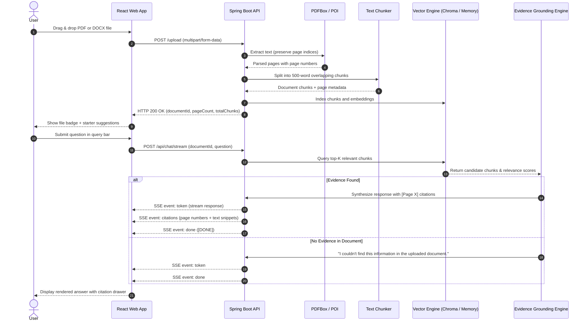

# Self-Verifying Multilingual RAG for Evidence-Grounded Question Answering over Long Documents

[](https://spring.io/projects/spring-boot)
[](https://reactjs.org/)
[](https://vitejs.dev/)
[](https://pdfbox.apache.org/)
[](https://poi.apache.org/)
[](https://www.trychroma.com/)
[](https://opensource.org/licenses/MIT)

> **DocQuery AI**: A production-grade, full-stack Retrieval-Augmented Generation (RAG) platform that reads long multi-page PDF and DOCX files, extracts text with physical page preservation, performs semantic chunking, indexes embeddings, and delivers evidence-grounded answers with verifiable page-level citations.

---

## 🏛️ System Architecture

```mermaid
graph TD
    subgraph UI ["Client Layer (React + Tailwind CSS)"]
        A[User Upload: PDF / DOCX] -->|Multipart Form-Data| B(Upload Dropzone)
        Q[User Query] -->|JSON / SSE Stream| C(ChatGPT-Style Query Bar)
        C --> D[Centered Conversation Stream]
        D --> E[Interactive Citation Cards & Page Badges]
    end

    subgraph API ["Gateway & Controller Layer (Spring Boot 3)"]
        B -->|POST /upload| CTRL_UP[DocumentController: /upload]
        C -->|POST /api/chat/stream| CTRL_CHAT[DocumentController: /chat & /stream]
        CTRL_STATUS[DocumentController: /api/status]
    end

    subgraph INGESTION ["Document Ingestion & Parsing Engine"]
        CTRL_UP --> PARSER_SVC{DocumentParserService}
        PARSER_SVC -->|PDF| PDFBOX[Apache PDFBox 3.x Engine<br/>Page-by-Page Extraction]
        PARSER_SVC -->|DOCX| POI[Apache POI 5.x Engine<br/>Paragraph & Table Extraction]
        PDFBOX --> CHUNKER[Text Chunker Service<br/>~500 Words + 60 Word Overlap]
        POI --> CHUNKER
        CHUNKER --> CHUNK_STORE[(Document Context Registry)]
    end

    subgraph RETRIEVAL ["Hybrid Retrieval & Evidence Verification Engine"]
        CTRL_CHAT --> RAG_SVC[RagService Orchestrator]
        RAG_SVC --> QUERY_VEC[Query Analysis & Tokenization]
        QUERY_VEC --> RETRIEVER{Multi-Tier Retriever}

        RETRIEVER -->|Embeddings| CHROMA[ChromaDB REST API<br/>Cosine Space: http://localhost:8000]
        RETRIEVER -->|In-Memory Cache| IN_MEM[(In-Memory Vector Store<br/>Cosine Similarity)]
        RETRIEVER -->|Keyword / BM25| LEXICAL[Local Semantic Search<br/>Sentence Scoring Engine]

        CHROMA -.->|Fallback| IN_MEM
        IN_MEM -.->|Fallback| LEXICAL
    end

    subgraph GROUNDING ["Evidence Grounding & Generation"]
        CHROMA --> RANKER[Relevance Ranker & Context Filter]
        IN_MEM --> RANKER
        LEXICAL --> RANKER
        RANKER --> VERIFIER{Evidence Verifier}
        VERIFIER -->|Sufficient Evidence| SYNTH[Answer Synthesis Engine]
        VERIFIER -->|No Match| NOT_FOUND["I couldn't find this information in the uploaded document."]
        SYNTH --> CITE_GEN[Page Citation Generator<br/>[Page X] + Excerpt Snippets]
    end

    CITE_GEN -->|SSE Event: token & citations| D
    NOT_FOUND -->|SSE Event: token| D
```

---

## 🔄 Query & Evidence-Grounding Sequence Flow



---

## 🌟 Key Features

### 1. Multi-Format Native Parsing
- **PDF Extraction**: Uses **Apache PDFBox 3.x** to parse physical pages individually, guaranteeing that every retrieved excerpt points back to the exact page number.
- **DOCX Extraction**: Uses **Apache POI 5.x** to extract paragraphs, headings, and tables into structured, page-mapped blocks.
- **High Capacity**: Tested on documents ranging from single-page contracts to 70+ page technical manuals.

### 2. Evidence Grounding & Anti-Hallucination Guardrails
- **Ground-Truth Enforced**: The system restricts responses strictly to the document contents.
- **Explicit Fallback**: If query terms are absent from the document context, it responds deterministically:
  > *"I couldn't find this information in the uploaded document."*
- **Verifiable Citations**: Every claim is annotated with its source page (e.g. `[Page 2]`) and includes expandable excerpts and match confidence scores.

### 3. Dual-Engine Flexibility (Cloud or 100% Offline)
- **Local Engine (Default)**: Runs completely on your local machine with **zero external API dependencies**, no cloud account, and complete data privacy.
- **Gemini RAG Mode (Optional)**: If configured with a Gemini API key (`GEMINI_API_KEY`), automatically leverages `text-embedding-004` and `gemini-1.5-flash` with streaming SSE.
- **Vector DB Failover**: Integrates with **ChromaDB** (`http://localhost:8000`) and seamlessly falls back to an internal **In-Memory Cosine Vector Store** if ChromaDB is offline.

### 4. Minimalist ChatGPT-Inspired UI
- Clean, responsive white/light aesthetic with subtle micro-animations.
- Centered conversation stream with starter prompt chips.
- Fixed bottom input bar with attachment icon (upload/replace file), auto-resizing textarea, and active send button.
- Expandable citation drawer with similarity scores and exact excerpt snippets.

---

## 📁 Repository Structure

```
.
├── backend/                             # Spring Boot 3 Java Backend
│   ├── pom.xml                          # Maven dependencies (PDFBox, POI, Web, Jackson)
│   ├── mvnw & mvnw.cmd                  # Portable Maven Wrapper
│   └── src/
│       ├── main/
│       │   ├── java/com/docquery/
│       │   │   ├── DocQueryApplication.java          # Spring Boot Main + CORS
│       │   │   ├── controller/
│       │   │   │   └── DocumentController.java       # /upload, /chat, /api/chat/stream
│       │   │   ├── model/                            # Data Transfer Objects
│       │   │   │   ├── DocumentChunk.java
│       │   │   │   ├── Citation.java
│       │   │   │   ├── ChatRequest.java / ChatResponse.java
│       │   │   │   └── UploadResponse.java
│       │   │   └── service/
│       │   │       ├── RagService.java               # Core RAG Orchestrator
│       │   │       ├── chunking/TextChunker.java     # 500-Word Overlap Chunker
│       │   │       ├── gemini/GeminiApiClient.java   # Gemini Embedding & Chat Client
│       │   │       ├── parser/                       # Apache PDFBox & POI Parsers
│       │   │       └── vector/                       # ChromaDB & In-Memory Stores
│       │   └── resources/application.properties
│       └── test/java/com/docquery/      # Automated Unit & Generation Tests
│
├── frontend/                            # React + Vite + Tailwind CSS Frontend
│   ├── package.json
│   ├── vite.config.js                   # Proxy configuration to backend
│   ├── tailwind.config.js
│   ├── src/
│   │   ├── App.jsx                      # Main RAG state & SSE stream reader
│   │   ├── index.css                    # Typography, scrollbars & markdown styles
│   │   └── components/
│   │       ├── Navbar.jsx               # Header with document status badge
│   │       ├── ChatArea.jsx             # Centered stream & prompt suggestions
│   │       ├── ChatMessage.jsx          # Message bubbles & markdown parser
│   │       ├── InputBar.jsx             # Fixed bottom bar with attachment icon
│   │       ├── SourceCitations.jsx      # Expandable page citation cards
│   │       ├── UploadDropzone.jsx       # Drag-and-drop document uploader
│   │       └── ApiKeyModal.jsx          # Live configuration modal
│
├── samples/                             # Sample Test Documents
│   ├── acme_company_handbook.pdf        # Multi-page test PDF
│   └── project_guidelines.docx          # Architecture test DOCX
│
├── chroma_server.py                     # Standalone Python ChromaDB launcher
├── run_chroma.bat                       # Windows one-click ChromaDB starter
├── .env.example
├── .gitignore
└── README.md
```

---

## ⚡ Quick Start

### Prerequisites
- **Java**: JDK 17, 21, or 23 installed
- **Node.js**: v18+ (includes npm)
- *(Optional)* **Python**: 3.10+ (if running ChromaDB locally)

---

### Step 1: Run the Backend

```bash
cd backend

# On Windows:
.\mvnw.cmd spring-boot:run

# On Linux / macOS:
./mvnw spring-boot:run
```
The backend starts at `http://localhost:8080`.

---

### Step 2: Run the Frontend

In a second terminal:
```bash
cd frontend
npm install
npm run dev
```
Open your browser at **`http://localhost:5173`**.

---

### Step 3: (Optional) Run ChromaDB

To run the local ChromaDB vector database:
```bash
# Double-click run_chroma.bat or run:
python -m pip install chromadb
python chroma_server.py
```
> *Note: If ChromaDB is not started, the application automatically uses its built-in in-memory cosine vector store with zero downtime.*

---

## 📡 REST API Reference

### 1. Document Upload
- **POST** `/upload` or `/api/upload`
- **Content-Type**: `multipart/form-data`
- **Parameter**: `file` (Binary `.pdf` or `.docx`)
- **Sample Response**:
  ```json
  {
    "documentId": "doc_bb300a8f87a2",
    "fileName": "acme_company_handbook.pdf",
    "fileSize": 1644,
    "pageCount": 2,
    "totalChunks": 1,
    "message": "Document parsed and indexed successfully. Ready to answer questions!"
  }
  ```

### 2. Chat Query (JSON)
- **POST** `/chat` or `/api/chat`
- **Content-Type**: `application/json`
- **Request Body**:
  ```json
  {
    "documentId": "doc_bb300a8f87a2",
    "question": "How many days of PTO do employees get?"
  }
  ```
- **Sample Response**:
  ```json
  {
    "answer": "Based on [Pages 1-2] of the document:\n\n- **[Pages 1-2]** Full-time employees receive 25 days of paid time off per calendar year.",
    "citations": [
      {
        "startPage": 1,
        "endPage": 2,
        "pageDisplay": "Pages 1-2",
        "chunkIndex": 0,
        "snippet": "Full-time employees receive 25 days of paid time off per calendar year.",
        "relevanceScore": 0.9
      }
    ],
    "documentId": "doc_bb300a8f87a2"
  }
  ```

### 3. Real-Time Streaming Chat (SSE)
- **POST** `/api/chat/stream`
- **Accept**: `text/event-stream`
- **Event Stream**:
  - `event: token` -> `{"token": "Based "}`
  - `event: citations` -> `[{"pageDisplay": "Pages 1-2", ...}]`
  - `event: done` -> `[DONE]`

### 4. Health & Engine Status
- **GET** `/api/status`
- **Sample Response**:
  ```json
  {
    "hasApiKey": true,
    "mode": "Local Document Intelligence (Zero API Required)",
    "vectorStoreType": "Local In-Memory Document Index",
    "documentsCount": 1
  }
  ```

---

## 🧪 Testing & Verification

Run automated Maven test suites:
```bash
cd backend
.\mvnw.cmd test
```

Included unit test coverage:
1. `DocumentParserTest`: Validates physical multi-page text extraction for PDFBox and Apache POI.
2. `TextChunkerTest`: Confirms ~500-word chunks with overlap and page boundary tracking.
3. `VectorStoreTest`: Verifies cosine similarity mathematical ranking.
4. `SampleDocumentGenerator`: Generates multi-page PDF & DOCX test files into `samples/`.

---

## 📄 License

Distributed under the MIT License. See `LICENSE` for more information.
